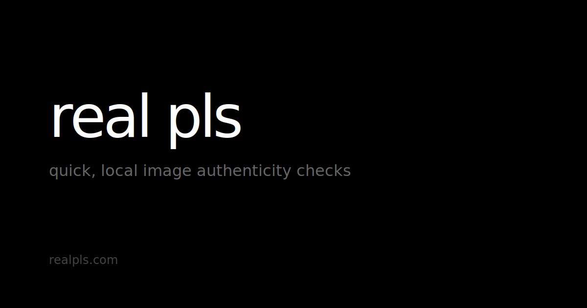

# realpls

**Quick, local image authenticity checks.**

A modern, browser-based image forensics tool that runs entirely client-side. Analyze images for potential manipulation without uploading them anywhere.

🔗 **[realpls.com](https://realpls.com)**



## Features

- **100% Local Processing** — Your images never leave your device
- **No Backend Required** — All analysis happens in the browser
- **Multiple Forensic Checks:**
  - File type verification (magic bytes)
  - EXIF metadata extraction and analysis
  - Editing software detection
  - JPEG quality estimation
  - Compression artifact analysis
  - Noise consistency mapping
  - Edge analysis
  - Clone detection (copy-paste regions)
  - Error Level Analysis (ELA)
  - Social media reupload detection
- **Visual Overlays** — View noise maps, edge maps, and ELA heatmaps
- **Exportable Reports** — Download analysis results as JSON
- **Responsive Design** — Works on desktop and mobile
- **Dark Mode Support** — Respects system preferences

## Tech Stack

- [Astro](https://astro.build/) — Static site framework
- TypeScript — Type-safe code
- Vanilla CSS — No heavy UI libraries
- [exifr](https://github.com/MikeKovarik/exifr) — Lightweight EXIF parsing
- Web APIs — Canvas, FileReader, ImageData

## Development

### Prerequisites

- Node.js 18+ 
- npm or pnpm

### Getting Started

```bash
# Install dependencies
npm install

# Start development server
npm run dev

# Build for production
npm run build

# Preview production build
npm run preview
```

The development server runs at `http://localhost:4321`.

## Deployment (Cloudflare Pages)

This project is optimized for Cloudflare Pages deployment.

### Quick Deploy

1. Push your code to a GitHub/GitLab repository
2. Go to [Cloudflare Pages](https://pages.cloudflare.com/)
3. Create a new project and connect your repository
4. Configure build settings:
   - **Build command:** `npm run build`
   - **Build output directory:** `dist`
   - **Node.js version:** 18 (or later)
5. Deploy!

### Manual Deploy

```bash
# Build the project
npm run build

# The output is in the 'dist' directory
# Upload this to Cloudflare Pages via the dashboard or CLI
```

### Environment Variables

No environment variables are required. The app works without any configuration.

## Project Structure

```
src/
├── components/          # Astro components
│   ├── Header.astro
│   ├── Footer.astro
│   ├── Button.astro
│   ├── Card.astro
│   ├── Badge.astro
│   ├── Progress.astro
│   ├── KeyValue.astro
│   ├── UploadArea.astro
│   └── ReportView.astro
├── layouts/
│   └── Layout.astro     # Base HTML layout
├── lib/
│   └── forensics/       # Core forensics library
│       ├── types.ts
│       ├── utils.ts
│       ├── pipeline.ts
│       ├── fileChecks.ts
│       ├── metadataChecks.ts
│       ├── compressionChecks.ts
│       ├── pixelChecks.ts
│       ├── elaCheck.ts
│       ├── socialMediaHint.ts
│       └── index.ts
├── pages/
│   ├── index.astro      # Home page
│   ├── about.astro      # About page
│   ├── privacy.astro    # Privacy policy
│   └── sitemap.xml.ts   # Dynamic sitemap
└── styles/
    └── global.css       # Design system
public/
├── demo/
│   └── sample.jpg       # Demo image
├── favicon.svg
├── og-image.svg
└── robots.txt
```

## Privacy

**Your images are never uploaded.** All processing happens locally in your browser using standard web APIs. There's no backend server, no analytics, no tracking. See the [Privacy Policy](https://realpls.com/privacy) for full details.

## Limitations

This tool provides **informational signals only**. It cannot definitively prove whether an image is "real" or "fake." 

- No AI/ML detection
- No deepfake detection  
- Not forensically admissible
- False positives and negatives are possible

See the [About page](https://realpls.com/about) for detailed information about each check and its limitations.

## License

MIT

## Author

Built by [swasilewski.com](https://swasilewski.com)

